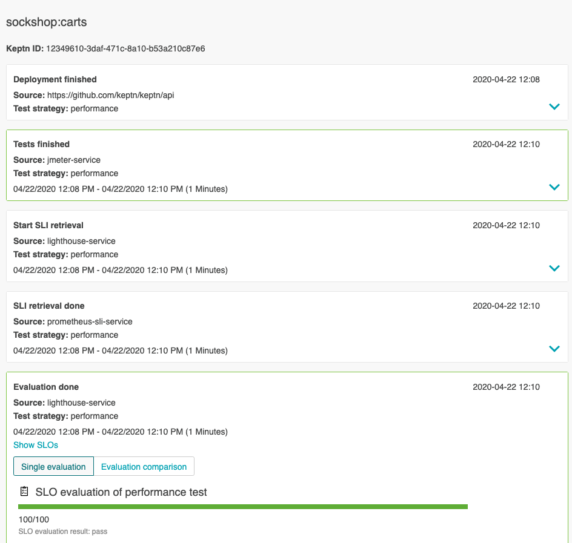
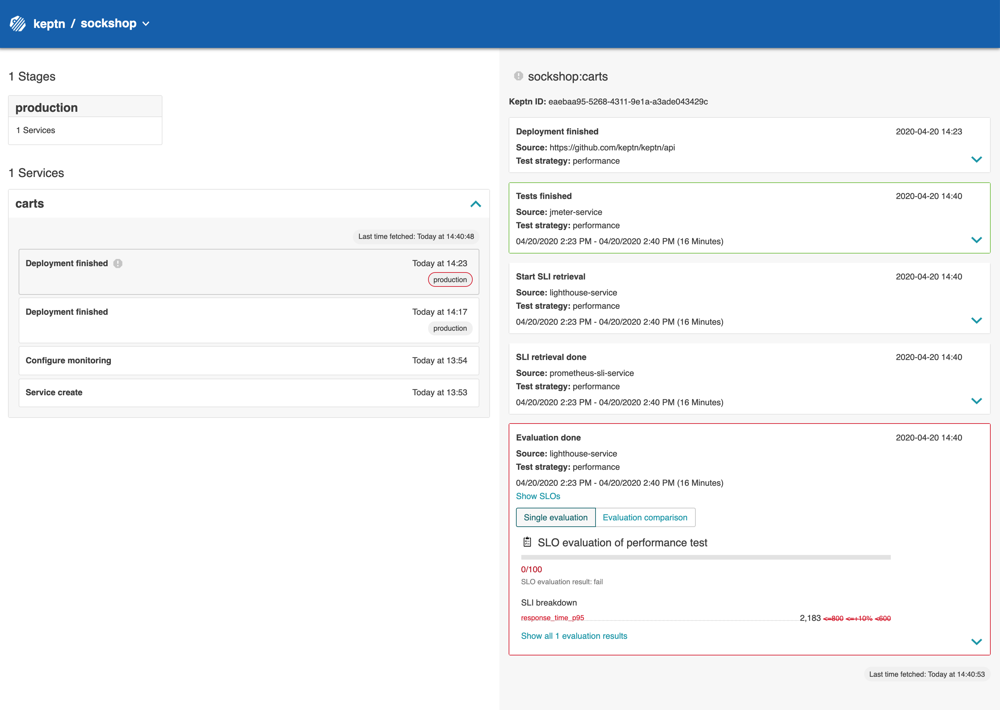
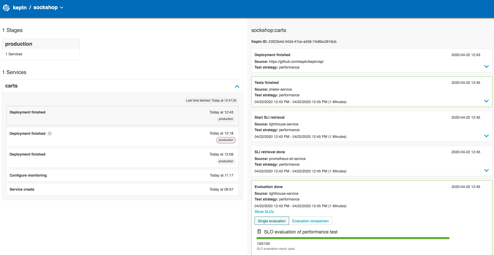

summary: Argo CD for Deploying and Keptn for Testing, Evaluating, and Promoting
id: keptn-argo-cd-deployment-07
categories: argocd,quality-gates
tags: keptn07x
status: Published
authors: Andreas Grimmer, Jürgen Etzlstorfer
Feedback Link: https://github.com/keptn/tutorials/tree/master/site/tutorials

# Argo CD for Deploying and Keptn for Testing, Evaluating, and Promoting

## Welcome 
Duration: 1:00

In this tutorial, [Argo CD](https://argoproj.github.io/argo-cd/) is used for deploying a [Argo Rollout](https://argoproj.github.io/argo-rollouts/) and Keptn is used for testing, evaluating, and promoting this rollout. More precisely, in this tutorial, Argo CD is used as deployment tool and not the Keptn built-in tool called `helm-service`. Furthermore, this tutorial uses [Argo Rollouts](https://argoproj.github.io/argo-rollouts/), which introduces a new custom resource called `Rollout` implementing deployment strategies such as Blue/Green and Canary.

This tutorial provides a sample Helm chart, which contains the `carts` and `carts-db` service. These services will be deployed into a `production` environment using Argo CD. Afterwards, Keptn will be used to test the carts service using performance tests. Using the resulting metrics provided by Prometheus, Keptn will then check whether this service passes the defined quality gate. Depending on whether the quality gate is passed or not, this service will be promoted or aborted. In case it will be promoted, this service will be released to real-users.


### What you'll learn

- Use Argo CD and Argo Rollout for deployment
- Use Keptn for initiating the tests
- Use Keptn for automated deployment validation (aka quality gates)
- Use Keptn for promotion of microservices if they pass the quality gate


## Prerequisites
Duration: 5:00

* A completed [Keptn installation](https://tutorials.keptn.sh/?cat=installation) (i.e. `keptn install` with flag `--use-case=continuous-delivery`)

* Basic knowledge of [Argo CD](https://argoproj.github.io/argo-cd/) and [Argo Rollouts](https://argoproj.github.io/argo-rollouts/)

* Completed [Argo CD installation](https://argoproj.github.io/argo-cd/getting_started/#1-install-argo-cd) and the `argocd` CLI needs to be [logged in](https://argoproj.github.io/argo-cd/getting_started/#4-login-using-the-cli)

* Completed [Argo Rollouts installation](https://argoproj.github.io/argo-rollouts/getting-started/#install-argo-rollouts)

* Clone example files used in this tutorial:

    ```
    git clone --branch 0.7.3 https://github.com/keptn/examples.git --single-branch
    ```

    ```
    cd examples/onboarding-carts
    ```


## Install the Keptn Argo-service
Duration: 2:00

The Keptn `argo-service` takes care of *promoting* or *aborting* a Rollout depending on the result of the quality gate. More precisely, the `argo-service` listens for `sh.keptn.events.evaluation-done` events and depending on the evaluation result (i.e. whether the quality gate is passed or not) the service promotes or aborts a rollout, respectively.

1. The `argo-service` is not contained in the default installation of Keptn.
To install the `argo-service`, execute:

    ```
    kubectl apply -f https://raw.githubusercontent.com/keptn-contrib/argo-service/0.1.1/deploy/service.yaml
    ```

1. The `gatekeeper-service` (which is installed by the default installation of Keptn) has to be removed:

    ```
    kubectl delete deployment gatekeeper-service -n keptn
    ```

## Create project sockshop
Duration: 5:00

This tutorial sets up a single stage environment containing a `production` environment. In this stage, performance tests are used to test new deployments. For creating the project, the following shipyard is used:

```
stages:
  - name: "production"
    deployment_strategy: "blue_green_service"
    test_strategy: "performance"
```

Create a new project for your services using the `keptn create project` command. In this tutorial, the project is called *sockshop*. The Git user (`--git-user`), an access token (`--git-token`), and the remote URL (`--git-remote-url`) are required for configuring an upstream. For details, please visit [Git-based upstream](https://keptn.sh/docs/0.7.x/manage/git_upstream/) where instructions for GitHub, GitLab, and Bitbucket are provided. 
Before executing the following command, make sure you are in the `examples/onboarding-carts` folder:

```
keptn create project sockshop --shipyard=./shipyard-argo.yaml --git-user=GIT_USER --git-token=GIT_TOKEN --git-remote-url=GIT_REMOTE_URL
```

## Create carts service
Duration: 5:00

1. Keptn manages all service-related artifacts (like testing files, SLOs, etc.),
in a so-called service. 
Create a service for *carts* using the `keptn create service` command:

    ```
    keptn create service carts --project=sockshop
    ```


1. After creating the service, Keptn allows to add service-related artifacts like the performance test:

    ```
    keptn add-resource --project=sockshop --stage=production --service=carts --resource=jmeter/load.jmx --resourceUri=jmeter/load.jmx
    ```


## Set up the quality gate and monitoring
Duration: 5:00

Keptn's quality gate is specified by *Service Level Objectives* (SLOs). In order to pass this quality gate, the service has to meet the SLOs. These SLOs are described in a file called `slo.yaml`. To learn more about the *slo.yaml* file, go to [Specifications for Site Reliability Engineering with Keptn](https://github.com/keptn/spec/blob/0.1.2/sre.md).

Activate the quality gates for the `carts` service. Therefore, navigate to the `examples/onboarding-carts` folder and upload the `slo.yaml` file using the `add-resource` command:

```
keptn add-resource --project=sockshop --stage=production --service=carts --resource=slo-quality-gates.yaml --resourceUri=slo.yaml
```

For evaluating the SLOs, metrics from a monitoring tool are required. Currently, this tutorial supports *Prometheus* as a monitoring tool, which is set up in the following steps:

1. Install the Keptn Prometheus-service in your Kubernetes cluster.

    ```
    kubectl apply -f https://raw.githubusercontent.com/keptn-contrib/prometheus-service/release-0.3.5/deploy/service.yaml
    ```

1. Install the Prometheus SLI provider in your cluster.

    ```
    kubectl apply -f https://raw.githubusercontent.com/keptn-contrib/prometheus-sli-service/release-0.2.2/deploy/service.yaml
    ```

1. Configure Prometheus as monitoring solution.

    ```
    keptn configure monitoring prometheus --project=sockshop --service=carts
    ```

1. Configure custom SLIs for the Prometheus SLI provider as specified in `sli-config-argo-prometheus.yaml`:

    ```
    keptn add-resource --project=sockshop --stage=production --service=carts --resource=sli-config-argo-prometheus.yaml --resourceUri=prometheus/sli.yaml
    ```

## Add Deployment Resources
Duration: 5:00

This tutorial provides deployment resources (in the form of a [Helm chart](https://helm.sh/)), which contains the `carts` and `carts-db` service. The `carts` service is of type `rollout`, which allows a *blue/green deployment*.

1. Argo CD requires a Git repo where this Helm chart is stored and, here, Keptn's config-repo is re-used. Execute the following command and replace `GIT_REMOTE_URL` with the URL as you used before when creating the Keptn project:

    ```
    git clone GIT_REMOTE_URL
    cd sockshop
    git checkout production
    ```
    
1. Copy the `argo` folder provided in the examples repo under `onboarding-carts/` into 
the config repo in the folder `carts`.

1. Add, commit, and push the changes:

    ```
    git add .
    git commit -m "Add deployment resources"
    git push
    ```

## Create Argo App
Duration: 4:00

Next, we set up an Argo app. Therefore, this tutorial assumes that you have completed the [Argo CD installation](https://argoproj.github.io/argo-cd/getting_started/#1-install-argo-cd) and [Argo Rollouts installation](https://argoproj.github.io/argo-rollouts/getting-started/#install-argo-rollouts).

1. Create an Argo app using the `argocd` CLI. Therefore, the app name has to follow the format `ServiceName-StageName` and the namespace has to follow the format `ProjectName-StageName`:

    ```
    argocd app create --name carts-production --repo GIT_REMOTE_URL --dest-server https://kubernetes.default.svc --dest-namespace sockshop-production --path carts/argo/carts --revision production --sync-policy none
    ```

1. Create a namespace in which the app is deployed:
    ```
    kubectl create namespace sockshop-production
    ```

## Add Argo Hook for triggering Keptn
Duration: 2:00

In order to infrom Keptn when Argo CD does the deployment,
an [Argo Resource Hook](https://argoproj.github.io/argo-cd/user-guide/resource_hooks/) is configured. This hook is triggered when Argo CD applies the manifests. This hook executes a script which sends a [`sh.keptn.events.deployment-finished`](https://github.com/keptn/spec/blob/master/cloudevents.md#deployment-finished) event to the Keptn API.

Therefore, this hook needs to access the Keptn API and, hence, requires the Keptn endpoint as well as the api-token.
Please create a secret with the Keptn endpoint and api-token:

```
KEPTN_API_URL=<KEPTN_API_URL>
KEPTN_API_TOKEN=<KEPTN_API_TOKEN>
kubectl -n sockshop-production create secret generic argo --from-literal="KEPTN_API_URL=$KEPTN_API_URL" --from-literal="KEPTN_API_TOKEN=$KEPTN_API_TOKEN"
```


```
apiVersion: batch/v1
kind: Job
metadata:
  generateName: app-keptn-notification-
  annotations:
    argocd.argoproj.io/hook: Sync
    argocd.argoproj.io/hook-delete-policy: HookSucceeded
spec:
  template:
    spec:
      containers:
      - name: keptn-notification
        image: agrimmer/alpine-curl-uuid-kubectl:latest
        command: ["/bin/sh","-c"]
        args: ['while [[ $(kubectl get rollout {{ .Values.keptn.service }}-{{ .Values.keptn.stage }} -n {{ .Values.keptn.project }}-{{ .Values.keptn.stage }} -o "jsonpath={..status.conditions[?(@.type==\"Progressing\")].reason}") == "ReplicaSetUpdated" ]]; do echo "waiting for rollout" && sleep 1; done; UUID=$(uuidgen); UUID=$(uuidgen); now=$(TZ=UTC date "+%FT%T.00Z"); curl -X POST -H "Content-Type: application/cloudevents+json" -H "x-token: ${KEPTN_API_TOKEN}" --insecure -d "{\"contenttype\": \"application/json\", \"data\": { \"project\": \"{{ .Values.keptn.project }}\", \"service\": \"{{ .Values.keptn.service }}\", \"stage\": \"{{ .Values.keptn.stage }}\", \"deploymentURILocal\": \"http://{{ .Values.keptn.service }}-canary.{{ .Values.keptn.project }}-{{ .Values.keptn.stage }}\", \"deploymentstrategy\": \"blue_green_service\", \"teststrategy\": \"performance\"}, \"id\": \"${UUID}\", \"source\": \"argo\", \"specversion\": \"0.2\", \"time\": \"${now}\", \"type\": \"sh.keptn.events.deployment-finished\", \"shkeptncontext\": \"${UUID}\"}" ${KEPTN_API_URL}/v1/event']
        env:
          - name: KEPTN_API_URL
            valueFrom:
              secretKeyRef:
                name: argo
                key: KEPTN_API_URL
            - name: KEPTN_API_TOKEN
              valueFrom:
                secretKeyRef:
                  name: argo
                  key: KEPTN_API_TOKEN
      restartPolicy: Never
  backoffLimit: 2
```

Positive
: In order to activate this hook, the Job has to be located in the Helm chart containing the deployment resources. The example chart in `onboarding-carts/argo/carts` already contains this Hook and, hence, it was already added in the step before.

## Deploy with Argo and Test, Evaluate, and Promote with Keptn
Duration: 5:00

1. Sync the Argo app using the ArgoCD UI or the `argocd` CLI:

    ```
    argocd app sync carts-production
    ```

1. Check whether the hook triggered Keptn. Therefore, go to Keptn's Bridge and check whether there is a `sh.keptn.events.deployment-finished` event.

1. Follow the events in the Keptn's Bridge and compare it to the screenshot below.

1. The new version (i.e. the `canary`) as well as the released version (i.e. the `primary`) of the `carts` service are exposed via a LoadBalancer. In order to access the website of the `carts` service, query the external IPs of the LoadBalancer:

    ```
    kubectl get services -n sockshop-production
    ```

    ```
    NAME            TYPE           CLUSTER-IP    EXTERNAL-IP     PORT(S)        AGE
    carts-canary    LoadBalancer   10.3.10.175   35.x.x.x        80:32475/TCP   47h
    carts-db        ClusterIP      10.3.1.153    <none>          27017/TCP      47h
    carts-primary   LoadBalancer   10.3.14.82    35.x.x.x        80:32597/TCP   47h
    ```

1. Navigate to `http://EXTERNAL-IP` for viewing both versions of the `carts` service in your `production` environment.

    


**Expected Result:** This version has passed the quality gate. Hence, you should see that both services serve the same content.

You will see these events in the Keptn's Bridge:




## Deploy a SLOW version 

Next, we will deploy a slow version of the carts service, which contains an artificial slowdown of 2 second in each request. This version must not pass the quality gate and, hence, should not be promoted to serve real-user traffic.

1. In your Git reposititory containing the Argo resources, go to the folder `carts/argo/carts` and open the `values.yaml` file.

1. Edit the `tag` from `0.11.1` to `0.11.2`. 

1. Add, commit, and push these changes:
    ```
    git add .
    git commit -m "Use slow version"
    git push
    ```

1. Sync the Argo app using the ArgoCD UI or the `argocd` CLI:

    ```
    argocd app sync carts-production
    ```

1. Follow the events in the Keptn's Bridge and compare it to the screenshot below. Please note that the performance tests will take approx. 20 minutes.

    


1. Navigate to `http://EXTERNAL-IP` for viewing both versions of the `carts` service in your `production` environment.

    

    


**Expected Result:** This version `0.11.2` should not pass the quality gate. The `primary` version should still show the last version `0.11.1`.

## Deploy a fast version

Finally, we will deploy a version which does _not_ contain the slowdown anymore.
This version should now again pass the quality gate and, hence, should be promoted to serve real-user traffic.

1. In your Git reposititory containing the Argo resources, go to the folder `carts/argo/carts` and open the `values.yaml` file.

1. Edit the `tag` from `0.11.2` to `0.11.3`. 

1. Add, commit, and push these changes:
    ```
    git add .
    git commit -m "Use fast version"
    git push
    ```

1. Sync the Argo app using the ArgoCD UI or the `argocd` CLI:

    ```
    argocd app sync carts-production
    ```

1. Follow the events in the Keptn's Bridge and compare it to the screenshot below. 

1. Navigate to `http://EXTERNAL-IP` for viewing both versions of the `carts` service in your `production` environment.

**Expected Result:** This version `0.11.3` should pass the quality gate. The `primary` version should show version `0.11.3`.

  


Your Bridge should show an event flow similar to the one in this screenshot:

  

## Finished
Duration: 00:00

Congratulations! 

You have successfully finished the tutorial on using ArgoCD/Rollouts for deployment and Keptn for testing, evaluation and promoting your microservices.

