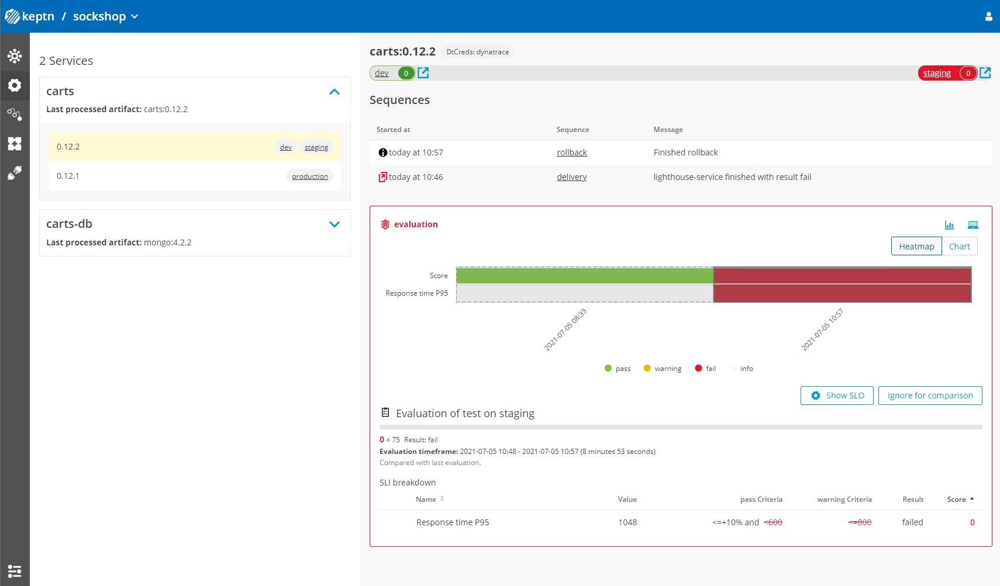

summary: Take a full tour on Keptn with Dynatrace
id: keptn-full-tour-dynatrace-07
categories: Dynatrace,aks,eks,gke,openshift,pks,minikube,full-tour,quality-gates,automated-operations
tags: keptn07x
status: Published 
authors: Jürgen Etzlstorfer
Feedback Link: https://github.com/keptn/tutorials/tree/master/site/tutorials


# Keptn Full Tour on Dynatrace

## Welcome
Duration: 2:00 


In this tutorial you'll get a full tour through Keptn. Before we get started you'll get to know what you will learn while you walk yourself through this tutorial.

### What you'll learn
- How to create a sample project
- How to onboard a first microservice
- How to deploy your first microservice with blue/green deployments
- How to setup quality gates 
- How to prevent bad builds of your microservice to reach production
- How to trigger the changes of feature toggles in response to issues detected in a production system
- How to integrate other tools like Slack, MS Team, etc in your Keptn integration

You'll find a time estimate until the end of this tutorial in the right top corner of your screen - this should give you guidance how much time is needed for each step.

In this tutorial, we are going to install Keptn on a Kubernetes cluster, along with Istio for traffic routing and ingress control.

{{ snippets/07/install/cluster.md }}

{{ snippets/07/install/istio.md }}

{{ snippets/07/install/download-keptnCLI.md }}

{{ snippets/07/install/install-full.md }}

{{ snippets/07/install/configureIstio.md }}

{{ snippets/07/install/authCLI-istio.md }}

<!-- include other files -->

{{ snippets/07/monitoring/setupDynatrace.md }}

{{ snippets/07/manage/createProject.md }}

{{ snippets/07/manage/onboardService.md }}

## Setup SLI provider
Duration: 2:00

During the evaluation of a quality gate, the Dynatrace SLI provider is required that is implemented by an internal Keptn service, the dynatrace-sli-service. This service will fetch the values for the SLIs that are referenced in an SLO configuration.

```
kubectl apply -f https://raw.githubusercontent.com/keptn-contrib/dynatrace-sli-service/0.5.0/deploy/service.yaml
```

Next we are going to add an SLI configuration file for Keptn to know how to retrieve the data.
Please make sure you are in the correct folder that is `examples/onboarding-carts`. If not, please change the directory accordingly, e.g., with `cd ../../onboarding-carts/`. We are going to add it globally to the project for all services and stages we create.
```
keptn add-resource --project=sockshop --resource=sli-config-dynatrace.yaml --resourceUri=dynatrace/sli.yaml
```

Configure the already onboarded project with the new SLI provider for Keptn to create some needed resources (e.g., a configmap):

```
keptn configure monitoring dynatrace --project=sockshop
```

Positive
: Since we already installed the Dynatrace service, the SLI provider can fetch the credentials to connect to Dynatrace from the same secret we created earlier.

{{ snippets/07/quality-gates/setupQualityGate.md }}

{{ snippets/07/self-healing/featureFlagsDynatrace.md }}


## Finish
Duration: 1:00

### Congratulations

Thanks for taking a full tour through Keptn!
Although Keptn has even more to offer that should have given you a good overview what you can do with Keptn.

### What we've covered


- We have created a sample project with the Keptn CLI and set up a multi-stage delivery pipeline with the `shipyard` file.
  ```
stages:
  - name: "dev"
    deployment_strategy: "direct"
    test_strategy: "functional"
  - name: "staging"
    approval_strategy: 
      pass: "automatic"
      warning: "automatic"
    deployment_strategy: "blue_green_service"
    test_strategy: "performance"
  - name: "production"
    approval_strategy: 
      pass: "automatic"
      warning: "manual"
    deployment_strategy: "blue_green_service"
    remediation_strategy: "automated"
  ```

- We have set up quality gates based on service level objectives in our `slo` file.
  ```
  ---
  spec_version: "0.1.1"
  comparison:
    aggregate_function: "avg"
    compare_with: "single_result"
    include_result_with_score: "pass"
    number_of_comparison_results: 1
  filter:
  objectives:
    - sli: "response_time_p95"
      key_sli: false
      pass:             # pass if (relative change <= 10% AND absolute value is < 600ms)
        - criteria:
            - "<=+10%"  # relative values require a prefixed sign (plus or minus)
            - "<600"    # absolute values only require a logical operator
      warning:          # if the response time is below 800ms, the result should be a warning
        - criteria:
            - "<=800"
      weight: 1
  total_score:
    pass: "90%"
    warning: "75%"
  ```

- We have tested our quality gates by deploying a bad build to our cluster and verified that Keptn quality gates stopped them.
  

- We have set up self-healing by automated toggling of feature flags in Unleash.
  

{{ snippets/07/integrations/gettingStarted.md }}

{{ snippets/07/community/feedback.md }}
