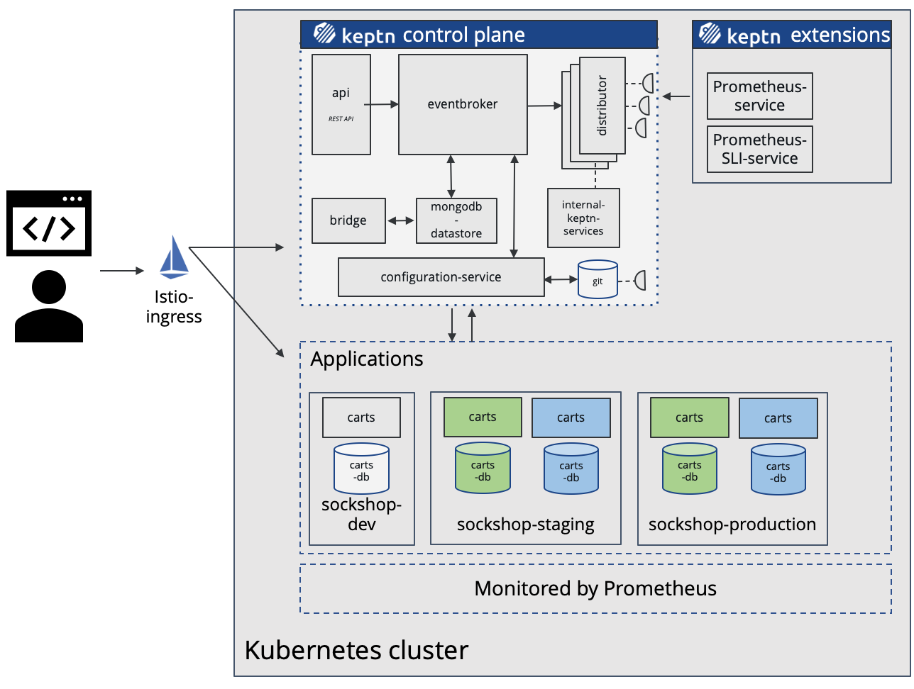
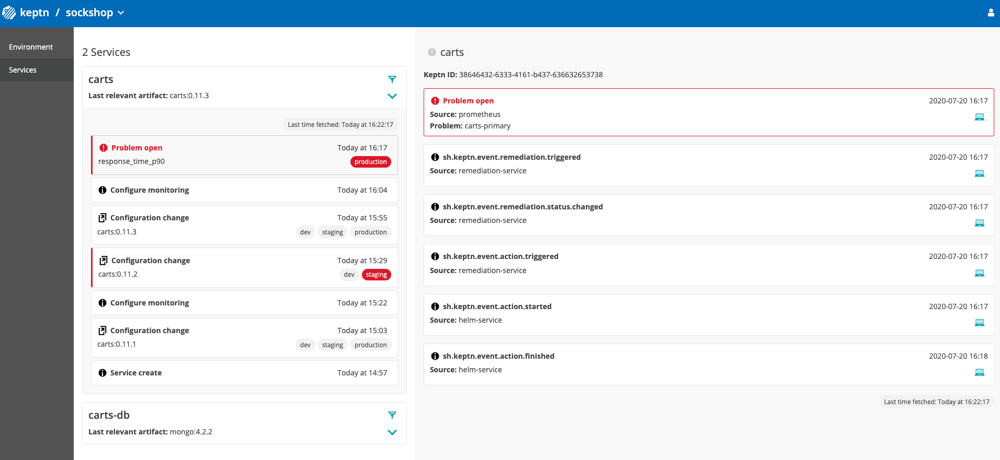

summary: Full Keptn installation on a Kubernetes cluster (GKE recommended)
id: keptn-full-tour-prometheus-011
categories: Prometheus,aks,eks,gke,openshift,pks,minikube,full-tour,quality-gates,automated-operations
tags: keptn011x,advanced
status: Published 
authors: Florian Bacher
Feedback Link: https://github.com/keptn/tutorials/tree/master/site/tutorials


# Keptn Full Tour on Prometheus

## Welcome
Duration: 2:00 

In this tutorial you'll get a full tour through Keptn. Before we get started you'll get to know what you will learn while you walk yourself through this tutorial.

### What we will cover
- How to create a sample project
- How to onboard a first microservice
- How to deploy your first microservice with blue/green deployments
- How to setup quality gates 
- How to prevent bad builds of your microservice to reach production
<!--  How to automatically scale your microservice with Keptn -->
- How to integrate other tools like Slack, MS Team, etc in your Keptn integration

You'll find a time estimate until the end of this tutorial in the right top corner of your screen - this should give you guidance how much time is needed for each step.


In this tutorial, we are going to install Keptn on a Kubernetes cluster, along with Istio for traffic routing and ingress control.

- [Keptn](https://keptn.sh) as a control-plane for continuous delivery and automated operations
- [Istio](https://istio.io) as the ingress and service mesh within the cluster for traffic routing between blue/green versions of our services

The full setup that we are going to deploy is sketched in the following image.


{{ snippets/11/install/cluster.md }}

{{ snippets/11/install/istio.md }}

{{ snippets/11/install/download-keptnCLI.md }}

{{ snippets/11/install/install-full.md }}

{{ snippets/11/install/configureIstio.md }}

{{ snippets/11/install/authCLI-istio.md }}

{{ snippets/11/manage/createProject.md }}

{{ snippets/11/manage/onboardService.md }}

{{ snippets/11/monitoring/setupPrometheus.md }}

{{ snippets/11/quality-gates/setupQualityGate.md }}

{{ snippets/11/self-healing/upscalePrometheus.md }}


## Finish
Duration: 1:00

Thanks for taking a full tour through Keptn!
Although Keptn has even more to offer that should have given you a good overview what you can do with Keptn.

### What we've covered

- We have created a sample project with the Keptn CLI and set up a multi-stage delivery pipeline with the `shipyard` file

  ```
apiVersion: "spec.keptn.sh/0.2.0"
kind: "Shipyard"
metadata:
  name: "shipyard-sockshop"
spec:
  stages:
    - name: "dev"
      sequences:
        - name: "artifact-delivery"
          tasks:
            - name: "deployment"
              properties:
                deploymentstrategy: "direct"
            - name: "test"
              properties:
                teststrategy: "functional"
            - name: "evaluation"
            - name: "release"
        - name: "artifact-delivery-db"
          tasks:
            - name: "deployment"
              properties:
                deploymentstrategy: "direct"
            - name: "release"

    ...
  ```

- We have set up quality gates based on service level objectives in our `slo` file
  ```
  ---
  spec_version: "1.0"
  comparison:
    aggregate_function: "avg"
    compare_with: "single_result"
    include_result_with_score: "pass"
    number_of_comparison_results: 1
  filter:
  objectives:
    - sli: "response_time_p95"
      key_sli: false
      pass:             # pass if (relative change <= 10% AND absolute value is < 600ms)
        - criteria:
            - "<=+10%"  # relative values require a prefixed sign (plus or minus)
            - "<600"    # absolute values only require a logical operator
      warning:          # if the response time is below 800ms, the result should be a warning
        - criteria:
            - "<=800"
      weight: 1
  total_score:
    pass: "90%"
    warning: "75%"
  ```


- We have tested our quality gates by deploying a bad build to our cluster and verified that Keptn quality gates stopped them.
  

<!--
- We have set up self-healing to automatically scale our application 
  
-->

{{ snippets/11/integrations/gettingStarted.md }}

{{ snippets/11/community/feedback.md }}
