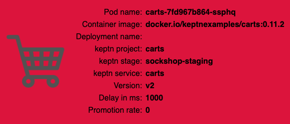
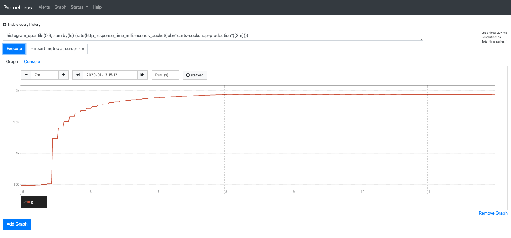
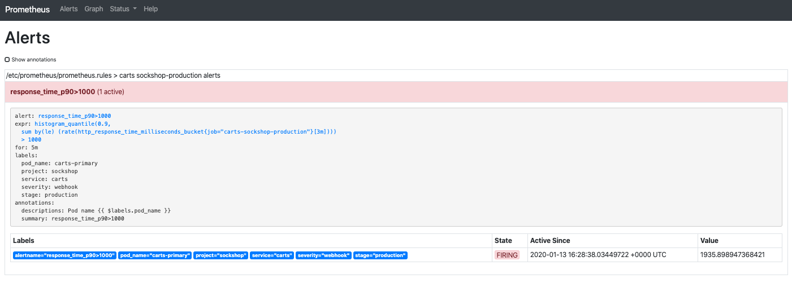
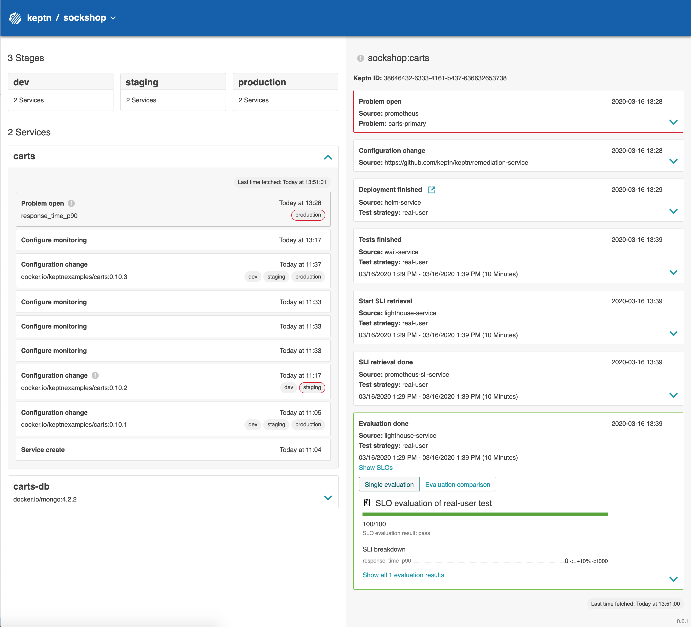

summary: Take a full tour on Keptn with Prometheus
id: keptn-full-tour-prometheus
categories: Prometheus,aks,eks,gke,openshift,pks,minikube
tags: keptn
status: Published 
authors: Jürgen Etzlstorfer
Feedback Link: https://keptn.sh


# Keptn Full Tour on Prometheus

## Welcome
Duration: 2:00 

In this tutorial you'll get a full tour through Keptn. Before we get started you'll get to know what you will learn while you walk yourself through this tutorial.

### What you'll learn
- How to create a sample project
- How to onboard a first microservice
- How to deploy your first microservice with blue/green deployments
- How to setup quality gates 
- How to prevent bad builds of your microservice to reach production
- How to automatically roll back bad builds of your microservices
- How to integrate other tools like Slack, MS Team, etc in your Keptn integration

You'll find a time estimate until the end of this tutorial in the right top corner of your screen - this should give you guidance how much time is needed for each step.

## Prerequisites
Duration: 10:00

Before you can get started, please make sure to have Keptn installed on your Kubernetes cluster.

If not, please [follow one of these tutorials to install Keptn](../../?cat=installation) on your favourite Kubernetes distribution.


<!-- include other files -->


## Create your first project
Duration: 8:00

A project in Keptn is the logical unit that can hold multiple (micro)services. Therefore, it is the starting point for each Keptn installation.

For creating a project, this tutorial relies on a `shipyard.yaml` file as shown below:

```
stages:
  - name: "dev"
    deployment_strategy: "direct"
    test_strategy: "functional"
  - name: "staging"
    deployment_strategy: "blue_green_service"
    test_strategy: "performance"
  - name: "production"
    deployment_strategy: "blue_green_service"
    remediation_strategy: "automated"
```


This shipyard contains three stages: dev, staging, and production. This results in the three Kubernetes namespaces: sockshop-dev, sockshop-staging, and sockshop-production.

* **dev** will have a direct (big bang) deployment strategy and functional tests are executed
* **staging** will have a blue/green deployment strategy and performance tests are executed
* **production** will have a blue/green deployment strategy without any further testing. The configured remediation strategy is used for self-healing in production.


Positive
: To learn more about a *shipyard* file, please take a look at the [Shipyard specification](https://github.com/keptn/spec/blob/master/shipyard.md).

Create a new project for your services using the `keptn create project` command. In this example, the project is called *sockshop*. Before executing the following command, make sure you are in the `examples/onboarding-carts` folder.

Create a new project with Git upstream

To configure a Git upstream for this tutorial, the Git user (`--git-user`), an access token (`--git-token`), and the remote URL (`--git-remote-url`) are required. If a requirement is not met, go to [the Keptn documentation](https://keptn.sh/docs/0.6.0/manage/project/#select-git-based-upstream) where instructions for GitHub, GitLab, and Bitbucket are provided.

```
keptn create project sockshop --shipyard=./shipyard.yaml --git-user=GIT_USER --git-token=GIT_TOKEN --git-remote-url=GIT_REMOTE_URL
```


**Alternatively:** If you don't want to use a Git upstream, you can create a new project without it:
```
keptn create project sockshop --shipyard=./shipyard.yaml
```


## Onboard first microservice
Duration: 8:00

After creating the project, services can be onboarded to our project.

1. Onboard the **carts** service using the [keptn onboard service](../../reference/cli/#keptn-onboard-service) command:

```
keptn onboard service carts --project=sockshop --chart=./carts
```

1. After onboarding the service, tests (i.e., functional- and performance tests) need to be added as basis for quality gates in the different stages:

  * Functional tests for *dev* stage:

    ```
    keptn add-resource --project=sockshop --stage=dev --service=carts --resource=jmeter/basiccheck.jmx --resourceUri=jmeter/basiccheck.jmx
    ```

  * Performance tests for *staging* stage:

    ```
    keptn add-resource --project=sockshop --stage=staging --service=carts --resource=jmeter/load.jmx --resourceUri=jmeter/load.jmx
    ```

    **Note:** You can adapt the tests in `basiccheck.jmx` as well as `load.jmx` for your service. However, you must not rename the files because there is a hardcoded dependency on these file names in the current implementation of Keptn's jmeter-service. 

Since the carts service requires a mongodb database, a second service needs to be onboarded.

* Onboard the **carts-db** service using the [keptn onboard service](../../reference/cli/#keptn-onboard-service) command. The `--deployment-strategy` flag specifies that for this service a *direct* deployment strategy in all stages should be used regardless of the deployment strategy specified in the shipyard. Thus, the database is not blue/green deployed.

```
keptn onboard service carts-db --project=sockshop --chart=./carts-db --deployment-strategy=direct
```

During the onboarding of the services, Keptn creates a namespace for each stage based on the pattern: `projectname-stagename`.

* To verify the new namespaces, execute the following command:

```
kubectl get namespaces
```

```
NAME                  STATUS   AGE
...
sockshop-dev          Active   2m16s
sockshop-production   Active   2m16s
sockshop-staging      Active   2m16s
```

## Deploy first build with Keptn 
Duration: 5:00

After onboarding the services, a built artifact of each service can be deployed.

1. Deploy the carts-db service by executing the [keptn send event new-artifact](../../reference/cli/#keptn-send-event-new-artifact) command:

```
keptn send event new-artifact --project=sockshop --service=carts-db --image=docker.io/mongo --tag=4.2.2
```

1. Deploy the carts service by specifying the built artifact, which is stored on DockerHub and tagged with version 0.10.1:

```
keptn send event new-artifact --project=sockshop --service=carts --image=docker.io/keptnexamples/carts --tag=0.10.1
```

1. Go to Keptn's Bridge and check which events have already been generated. You can access it by a port-forward from your local machine to the Kubernetes cluster:

``` 
kubectl port-forward svc/bridge -n keptn 9000:8080
```

1. The Keptn's Bridge is then available on: http://localhost:9000. 

    It shows all deployments that have been triggered. On the left-hand side, you can see the deployment start events (i.e., so-called `Configuration change` events). During a deployment, Keptn generates events for controlling the deployment process. These events will also show up in Keptn's Bridge. Please note that if events are sent at the same time, their order in the Keptn's Bridge might be arbitrary since they are sorted on the granularity of one second. 

    

1. **Optional:** Verify the pods that should have been created for services carts and carts-db:

```
kubectl get pods --all-namespaces | grep carts
```

```
sockshop-dev          carts-77dfdc664b-25b74                            1/1     Running     0          10m
sockshop-dev          carts-db-54d9b6775-lmhf6                          1/1     Running     0          13m
sockshop-production   carts-db-54d9b6775-4hlwn                          2/2     Running     0          12m
sockshop-production   carts-primary-79bcc7c99f-bwdhg                    2/2     Running     0          2m15s
sockshop-staging      carts-db-54d9b6775-rm8rw                          2/2     Running     0          12m
sockshop-staging      carts-primary-79bcc7c99f-mbbgq                    2/2     Running     0          7m24s
```

## View carts service
Duration: 2:00

1. Get the URL for your carts service with the following commands in the respective namespaces:

  ```
  echo http://carts.sockshop-dev.$(kubectl get cm keptn-domain -n keptn -o=jsonpath='{.data.app_domain}')
  ```

  ```
  echo http://carts.sockshop-staging.$(kubectl get cm keptn-domain -n keptn -o=jsonpath='{.data.app_domain}')
  ```

  ```
  echo http://carts.sockshop-production.$(kubectl get cm keptn-domain -n keptn -o=jsonpath='{.data.app_domain}')
  ```

1. Navigate to the URLs to inspect the carts service. In the production namespace, you should receive an output similar to this:

  


## Setup Prometheus Monitoring
Duration: 4:00

After creating a project and service, you can setup Prometheus monitoring and configure scrape jobs using the Keptn CLI. 

1. To install the *prometheus-service*, execute: 
  ```
  kubectl apply -f https://raw.githubusercontent.com/keptn-contrib/prometheus-service/release-0.3.2/deploy/service.yaml
  ```

1. Execute the following command to set up the rules for the *Prometheus Alerting Manager*:
  ```
  keptn configure monitoring prometheus --project=PROJECTNAME --service=SERVICENAME
  ```

### Optional: Verify Prometheus setup in your cluster
* To verify that the Prometheus scrape jobs are correctly set up, you can access Prometheus by enabling port-forwarding for the prometheus-service:

    ```
    kubectl port-forward svc/prometheus-service 8080 -n monitoring
    ```

Prometheus is then available on [localhost:8080/targets](http://localhost:8080/targets) where you can see the targets for the service:


  


## Setup Prometheus SLI provider 
Duration: 3:00

During the evaluation of a quality gate, the Prometheus SLI provider is required that is implemented by an internal Keptn service, the *prometheus-sli-service*. This service will fetch the values for the SLIs that are referenced in a SLO configuration.

To install the *prometheus-sli-service*, execute:

```
kubectl apply -f https://raw.githubusercontent.com/keptn-contrib/prometheus-sli-service/0.2.1/deploy/service.yaml
```


## Set up the quality gate
Duration: 5:00

Keptn requires a performance specification for the quality gate. This specification is described in a file called `slo.yaml`, which specifies a Service Level Objective (SLO) that should be met by a service. To learn more about the *slo.yaml* file, go to [Specifications for Site Reliability Engineering with Keptn](https://github.com/keptn/spec/blob/0.1.3/sre.md).

Activate the quality gates for the carts service. Therefore, navigate to the `examples/onboarding-carts` folder and upload the `slo-quality-gates.yaml` file using the [add-resource](../../reference/cli/#keptn-add-resource) command:

```
keptn add-resource --project=sockshop --stage=staging --service=carts --resource=slo-quality-gates.yaml --resourceUri=slo.yaml
```

This will add the `SLO.yaml` file to your Keptn - which is the declaritive definition of a quality gate. Let's take a look at the file contents:

```
---
spec_version: "0.1.1"
comparison:
  aggregate_function: "avg"
  compare_with: "single_result"
  include_result_with_score: "pass"
  number_of_comparison_results: 1
filter:
objectives:
  - sli: "response_time_p95"
    key_sli: false
    pass:             # pass if (relative change <= 10% AND absolute value is < 600ms)
      - criteria:
          - "<=+10%"  # relative values require a prefixed sign (plus or minus)
          - "<600"    # absolute values only require a logical operator
    warning:          # if the response time is below 800ms, the result should be a warning
      - criteria:
          - "<=800"
    weight: 1
total_score:
  pass: "90%"
  warning: "75%"
```

## Deploy a slow build
Duration: 5:00

You can take a look at the currently deployed version of our "carts" microservice before we deploy the next build of our microservice.

1. Get the URL for your carts service with the following commands in the respective stages:

```
echo http://carts.sockshop-dev.$(kubectl get cm keptn-domain -n keptn -o=jsonpath='{.data.app_domain}')
```

```
echo http://carts.sockshop-staging.$(kubectl get cm keptn-domain -n keptn -o=jsonpath='{.data.app_domain}')
```

```
echo http://carts.sockshop-production.$(kubectl get cm keptn-domain -n keptn -o=jsonpath='{.data.app_domain}')
```

2. Navigate to `http://carts.sockshop-production.YOUR.DOMAIN` for viewing the carts service in your **production** environment and you should receive an output similar to the following:


## Deploy the slow carts version
Duration: 5:00


1. Use the Keptn CLI to deploy a version of the carts service, which contains an artificial **slowdown of 1 second** in each request.

```
keptn send event new-artifact --project=sockshop --service=carts --image=docker.io/keptnexamples/carts --tag=0.10.2
```

2. Go ahead and verify that the slow build has reached your `dev` and `staging` environments by opening a browser for both environments. Get the URLs with these commands:

```
echo http://carts.sockshop-dev.$(kubectl get cm keptn-domain -n keptn -o=jsonpath='{.data.app_domain}')
```

```
echo http://carts.sockshop-staging.$(kubectl get cm keptn-domain -n keptn -o=jsonpath='{.data.app_domain}')
```





## Quality gate in action
Duration: 10:00 

After triggering the deployment of the carts service in version v0.10.2, the following status is expected:

* **Dev stage:** The new version is deployed in the dev stage and the functional tests passed.
  * To verify, open a browser and navigate to: `http://carts.sockshop-dev.YOUR.DOMAIN`

* **Staging stage:** In this stage, version v0.10.2 will be deployed and the performance test starts to run for about 10 minutes. After the test is completed, Keptn triggers the test evaluation and identifies the slowdown. Consequently, a roll-back to version v0.10.1 in this stage is conducted and the promotion to production is not triggered.
  * To verify, the [Keptn's Bridge](https://keptn.sh/docs/0.6.0/reference/keptnsbridge/) shows the deployment of v0.10.2 and then the failed test in staging including the roll-back:

TODO 


* **Production stage:** The slow version is **not promoted** to the production stage because of the active quality gate in place. Thus, still version v0.10.1 is expected to be in production.
  * To verify, navigate to: `http://carts.sockshop-production.YOUR.DOMAIN`


## Verify the quality gate in Keptn's Bridge
Duration: 3:00

TODO


## Deploy a regular carts version
Duration: 3:00

1. Use the Keptn CLI to send a new version of the *carts* artifact, which does **not** contain any slowdown:
  ```
  keptn send event new-artifact --project=sockshop --service=carts --image=docker.io/keptnexamples/carts --tag=0.10.3
  ```

1. To verify the deployment in *production*, open a browser and navigate to `http://carts.sockshop-production.YOUR.DOMAIN`. As a result, you see `Version: v3`.

1. Besides, you can verify the deployments in your Kubernetes cluster using the following commands: 
  ```
  kubectl get deployments -n sockshop-production
  ``` 

  ```
  NAME            DESIRED   CURRENT   UP-TO-DATE   AVAILABLE   AGE
  carts-db        1         1         1            1           63m
  carts-primary   1         1         1            1           98m
  ```

  ```
  kubectl describe deployment carts-primary -n sockshop-production
  ``` 
  
  ```
  ...
  Pod Template:
    Labels:  app=carts-primary
    Containers:
      carts:
        Image:      docker.io/keptnexamples/carts:0.10.3
  ```


## Enable Self-Healing 
Duration: 2:00

Next, you will learn how to use the capabilities of Keptn to provide self-healing for an application without modifying code. In the next part, we configure Keptn to scale up the pods of an application if the application undergoes heavy CPU saturation. 

Configure remediation actions for up-scaling based on Prometheus alerts:

```
keptn add-resource --project=sockshop --stage=production --service=carts --resource=remediation.yaml --resourceUri=remediation.yaml
```

This is the content of the file that has being added:

```
remediations:
- name: response_time_p90
  actions:
  - action: scaling
    value: +1
- name: Response time degradation
  actions:
  - action: scaling
    value: +1
```

## Generate load for the service
Duration: 3:00

To simulate user traffic that is causing an unhealthy behavior in the carts service, please execute the following script. This will add special items into the shopping cart that cause some extensive calculation.

1. Move to the correct folder:
  ```
  cd ../load-generation/bin
  ```

1. Start the load generation script depending on your OS (replace \_OS\_ with linux, mac, or win):

  ```
  ./loadgenerator-_OS_ "http://carts.sockshop-production.$(kubectl get cm keptn-domain -n keptn -o=jsonpath='{.data.app_domain}')" cpu
  ```

1. (optional:) Verify the load in Prometheus.
    - Make a port forward to access Prometheus:

    ```
    kubectl port-forward svc/prometheus-service -n monitoring 8080:8080
    ```
    
    - Access Prometheus from your browser on http://localhost:8080.

    - In the **Graph** tab, add the expression 

    ```
    histogram_quantile(0.9, sum by(le) (rate(http_response_time_milliseconds_bucket{job="carts-sockshop-production"}[3m])))
    ```
    
    - Select the **Graph** tab to see your Response time metrics of the `carts` service in the `sockshop-production` environment.

    - You should see a graph which locks similar to this:

    


## Watch self-healing in action
Duration: 15:00

After approximately 10-15 minutes, the *Alert Manager* will send out an alert since the service level objective is not met anymore. 

1. To verify that an alert was fired, select the *Alerts* view where you should see that the alert `response_time_p90` is in the `firing` state:

 

After receiving the problem notification, the *prometheus-service* will translate it into a Keptn CloudEvent. This event will eventually be received by the *remediation-service* that will look for a remediation action specified for this type of problem and, if found, execute it.

In this tutorial, the number of pods will be increased to remediate the issue of the response time increase. 

1. Check the executed remediation actions by executing:

    ```
    kubectl get deployments -n sockshop-production
    ```

    You can see that the `carts-primary` deployment is now served by two pods:

    ```
    NAME             DESIRED   CURRENT   UP-TO-DATE   AVAILABLE   AGE
    carts-db         1         1         1            1           37m
    carts-primary    2         2         2            2           32m
    ```

1. Also you should see an additional pod running when you execute:

    ```
    kubectl get pods -n sockshop-production
    ```

    ```
    NAME                              READY   STATUS    RESTARTS   AGE
    carts-db-57cd95557b-r6cg8         1/1     Running   0          38m
    carts-primary-7c96d87df9-75pg7    2/2     Running   0          33m
    carts-primary-7c96d87df9-78fh2    2/2     Running   0          5m
    ```

1. To get an overview of the actions that got triggered by the response time SLO violation, you can use the Keptn's Bridge. You can access it by a port-forward from your local machine to the Kubernetes cluster:

    ``` 
    kubectl port-forward svc/bridge -n keptn 9000:8080
    ```

    Now, access the bridge from your browser on http://localhost:9000. 

    In this example, the bridge shows that the remediation service triggered an update of the configuration of the carts service by increasing the number of replicas to 2. When the additional replica was available, the wait-service waited for ten minutes for the remediation action to take effect. Afterwards, an evaluation by the lighthouse-service was triggered to check if the remediation action resolved the problem. In this case, increasing the number of replicas achieved the desired effect, since the evaluation of the service level objectives has been successful.
    
    

1. Furthermore, you can use Prometheus to double-check the response time:

    


## Finish
Duration: 1:00

Thanks for taking a full tour through Keptn!
Although Keptn has even more to offer that should have given you a good overview what you can do with Keptn.

### What we've covered

- We have created a sample project with the Keptn CLI and set up a multi-stage delivery pipeline with the `shipyard` file
- We have onboarded our first microservice
- We used a blue/green deployment to deploy the service 
- We have set up Prometheus to monitor our applications
- We have set up quality gates based on service level objectives
- We have tested our quality gates by deploying a bad build to our cluster and verified that Keptn quality gates stopped them.
- We have set up self-healing to automatically scale our application 
- We have learned how to extend our Keptn installation with other tools


## Getting started with Keptn integrations
Duration: 3:00

Keptn can be easily extended with external tools such as notification tools, other [SLI providers](link to docs), bots to interact with Keptn, etc.
While we do not cover additional integrations in this tutorial, please feel fee to take a look at our integration repositories:

- [Keptn Contrib](https://github.com/keptn-contrib) lists mature Keptn integrations that you can use for your Keptn installation
- [Keptn Sandbox](https://github.com/keptn-sandbox) collects mostly new integrations and those that are currently under development - however, you can also find useful integrations here.

Positive
: We are happy to receive your contributions - please [follow this guide](https://github.com/keptn-sandbox/contributing) if you want to contribute your own services to Keptn


