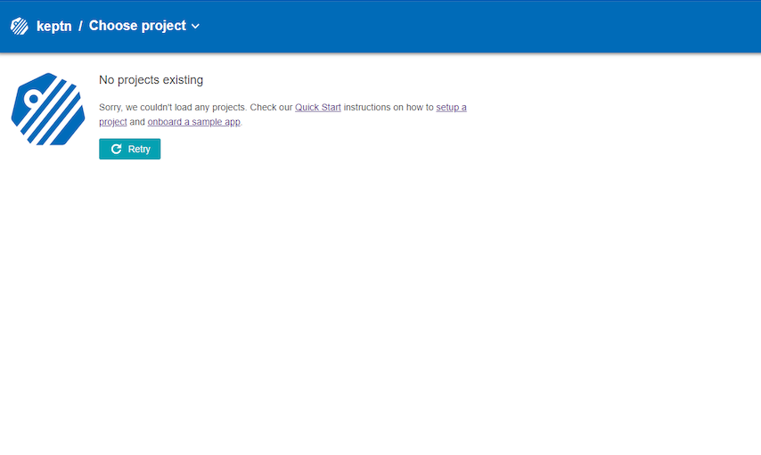

summary: Install Keptn on OpenShift
id: keptn-installation-openshift
categories: openshift,installation
tags: keptn06x
status: Published 
authors: Jürgen Etzlstorfer
Feedback Link: https://github.com/keptn/tutorials/tree/master/site/tutorials


# Keptn Installation on OpenShift

## Welcome
Duration: 2:00

In this tutorial we are going to learn how to install Keptn in your OpenShift cluster.


## Prerequisites for installation
Duration: 5:00

Please download and install the following tools if you do not have them installed on your machine already.

- [kubectl](https://kubernetes.io/docs/tasks/tools/install-kubectl/)


## Setup Kubernetes cluster
Duration: 10:00

We are going to setup an OpenShift cluster.


OpenShift 3.11

1. Install local tools

  - [oc CLI - v3.11](https://github.com/openshift/origin/releases/tag/v3.11.0)


1. On the OpenShift master node, execute the following steps:

- Set up the required permissions for your user:

    ```
    oc adm policy --as system:admin add-cluster-role-to-user cluster-admin <OPENSHIFT_USER_NAME>
    ```

- Set up the required permissions for the installer pod:

    ```
    oc adm policy  add-cluster-role-to-user cluster-admin system:serviceaccount:default:default
    oc adm policy  add-cluster-role-to-user cluster-admin system:serviceaccount:kube-system:default
    ```

- Enable admission WebHooks on your OpenShift master node:

    ```
sudo -i
cp -n /etc/origin/master/master-config.yaml /etc/origin/master/master-config.yaml.backup
oc ex config patch /etc/origin/master/master-config.yaml --type=merge -p '{
    "admissionConfig": {
    "pluginConfig": {
        "ValidatingAdmissionWebhook": {
        "configuration": {
            "apiVersion": "apiserver.config.k8s.io/v1alpha1",
            "kind": "WebhookAdmission",
            "kubeConfigFile": "/dev/null"
        }
        },
        "MutatingAdmissionWebhook": {
        "configuration": {
            "apiVersion": "apiserver.config.k8s.io/v1alpha1",
            "kind": "WebhookAdmission",
            "kubeConfigFile": "/dev/null"
        }
        }
    }
    }
}' >/etc/origin/master/master-config.yaml.patched
if [ $? == 0 ]; then
    mv -f /etc/origin/master/master-config.yaml.patched /etc/origin/master/master-config.yaml
    /usr/local/bin/master-restart api && /usr/local/bin/master-restart controllers
else
    exit
fi
    ```


## Download Keptn CLI
Duration: 3:00

Every release of Keptn provides binaries for the Keptn CLI. These binaries are available for Linux, macOS, and Windows.

There are multiple options how to get the Keptn CLI on your machine.

- Easiest option, if you are running on a Linux or Mac OS: 
  ```
  curl -sL https://get.keptn.sh | sudo -E bash
  ```
  This will download and install the Keptn CLI automatically.

-  Another option is to manually download the current release of the Keptn CLI:
  1. Download the version for your operating system from [Download CLI](https://github.com/keptn/keptn/releases/tag/0.6.1)
  1. Unpack the download
  1. Find the `keptn` binary in the unpacked directory

    - *Linux / macOS*: Add executable permissions (``chmod +x keptn``), and move it to the desired destination (e.g. `mv keptn /usr/local/bin/keptn`)

    - *Windows*: Copy the executable to the desired folder and add the executable to your PATH environment variable.


Now, you should be able to run the Keptn CLI: 
- Linux / macOS
  ```
  keptn --help
  ```

- Windows
  ```
  .\keptn.exe --help
  ```

Positive
: For the rest of the documentation we will stick to the *Linux / macOS* version of the commands.


## Install Keptn in your cluster
Duration: 7:00

To install the latest release of Keptn in your OpenShift cluster, execute the `keptn install` command with the `platform` flag specifying the target platform you would like to install Keptn on. 


```
keptn install --platform=openshift
```

Positive
: The installation process will take about 5-10 minutes.

### Installation details 

In the Kubernetes cluster, this command creates the **keptn**, **keptn-datastore**, and **istio-system** namespace. While istio-system contains all Istio related resources, keptn and keptn-datastore contain the complete infrastructure to run Keptn. 


## Open Keptn's bridge
Duration: 1:00

Now that you have installed Keptn you can take a look at its user interace aka the Keptn's Bridge.

Expose the bridge via the following command to be able to access on localhost:

```
kubectl port-forward svc/bridge -n keptn 9000:8080
```

Open a browser and navigate to http://localhost:9000 to take look. The bridge will be empty at this point but when using Keptn it will be populated with events.



Positive
: We are frequently providing early access versions of the Keptn's Bridge with new functionality - [learn more here](https://keptn.sh/docs/0.6.0/reference/keptnsbridge/#early-access-version-of-keptn-s-bridge)!


## Proceed with exploring Keptn
Duration: 1:00

Now that you have successfully installed Keptn, you can explore other tutorials!

Here are some possibilities:

- Take a full tour on Keptn with either [Prometheus](../../?cat=prometheus) or [Dynatrace](../../?cat=dynatrace)
- Explore [Keptn Quality Gates](../../?cat=quality-gates)
- Explore [Automated Operations with Keptn](../../?cat=automated-operations) 

