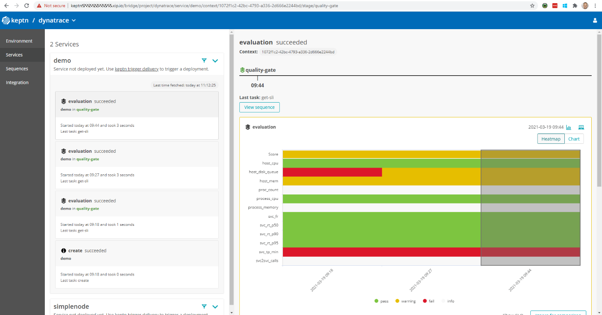
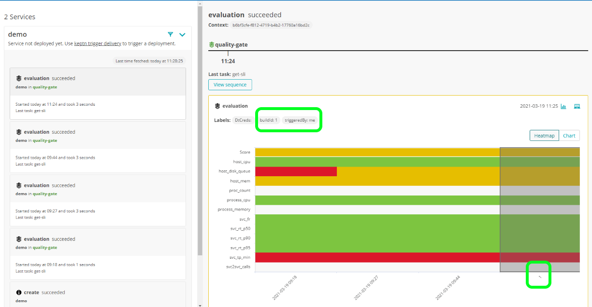
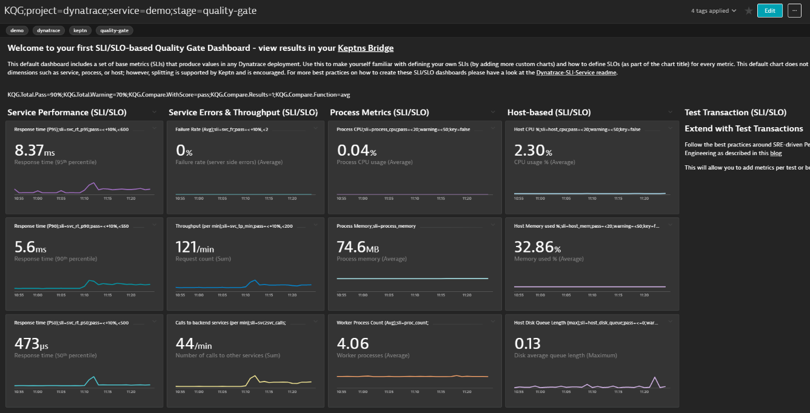
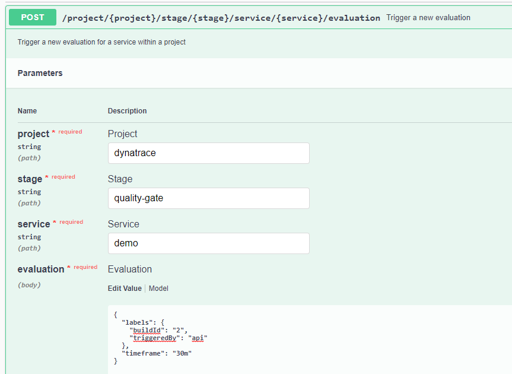
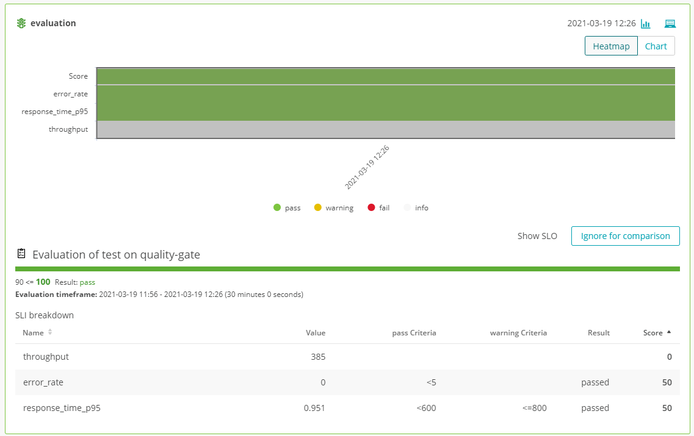
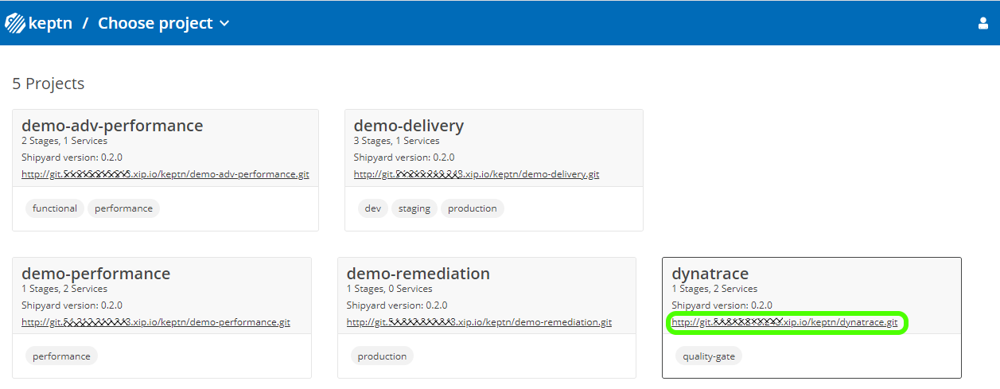
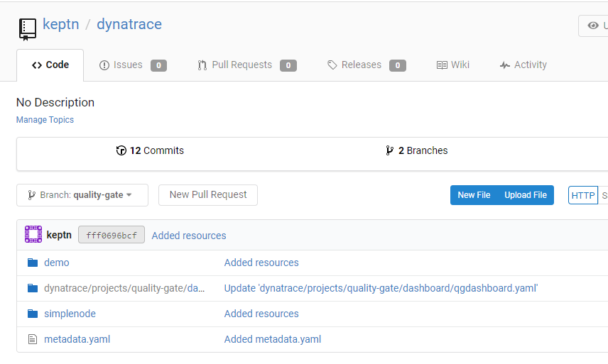

summary: 5 minute installation. All running on K3s with a single line installation. No Kubernetes cluster needed.
id: keptn-quality-gates-dynatrace-011-on-k3s
categories: Dynatrace,k3s,quality-gates
tags: keptn011x,introduction
status: Published
authors: Andreas Grabner
Feedback Link: https://github.com/keptn/tutorials/tree/master/site/tutorials


# Keptn Quality Gates with Dynatrace using k3s

## Welcome
Duration: 2:00

Watch the intro in this YouTube video to see what this tutorial includes:


If you have tools that deploy your applications and then run tests against those you have done the hard work already. *Keptn's Quality Gates* help you to automate the evaluation of your test results and the monitoring data captured during your tests. Keptn does this by embracing the concept of Service Level Indicators (SLIs) and Service Level Objectives (SLOs). Essentially SLIs are metrics such as Response Time, Throughput, Error Rate, Number of Database Calls, Time spent in external service calls, ... and SLOs define which objective you have for these SLIs to consider your service to be adhering to what you expect, e.g: Response Time of Login should be faster than 200ms or Login should not make more than 1 database query.
Keptn didn't come up with these concepts. They have been around for a while and made very popular thanks to the work that Google did around [Site Reliability Engineering](https://landing.google.com/sre/sre-book/chapters/service-level-objectives)

In this tutorial we teach you how you can use Keptn Quality Gates to automatically analyze important metrics (SLIs) that Dynatrace captures while your system is under load, e.g: during a load test and compare them against your expected behavior (SLOs). This comparison can either be against well defined thresholds, e.g: 200ms response time but can also be a comparison against previous test results, e.g: response time should not get slower than 10% of our previous build.

The real benefit is visualized in the following animation. Keptn Quality Gates help you automate the manual task of analyzing or comparing data on dashboards to determine whether a build meets your quality criteria.


## Installation of Keptn on k3s
Duration: 5:00

We have an extensive [Keptn on k3s](https://github.com/keptn-sandbox/keptn-on-k3s) tutorial on GitHub that includes setting up k3s, installing Keptn and automatically creating several Keptn projects to demo different use case with Dynatrace.
In this tutorial we are only focus on the Quality Gate use case for Dynatrace. If you want to explore more check out other tutorials on https://tutorials.keptn.sh or check out the full tutorial details on [Keptn on k3s](https://github.com/keptn-sandbox/keptn-on-k3s)

### Pre-Requs

**Linux Machine**
You should have a Linux machine with at least 2vCPUs and 8GB of RAM, e.g: EC2 t3.large.
If you want to run additional tutorials later, e.g: performance testing, continuous delivery .. then I suggest you get a machine with 8vCPUs and 32GB RAM, e.g: EC2 t3.2xlarge.
As we will be accessing Keptn that we install on that machine via HTTP and HTTPS make sure that both ports (80 & 443) are allowed by your firewall.
What we will need is SSH access to this machine and SUDO rights so we can execute our scripts

So - here is our checklist:
- [x] Large enough Linux Machine
- [x] Ports 80 & 443 are open
- [x] SSH access and SUDO rights

**Dynatrace Environment**
Next thing we need is a Dynatrace environment. If you don't have one - just sign up for a [Dynatrace SaaS Trial](https://dynatrace.com/trial). As this is a tutorial about Quality Gates which means - automating the analysis of data in Dynatrace please make sure that you are installing a Dynatrace OneAgent on at least one machine so that we can get some monitoring data. For more details simply follow the steps that the Dynatrace trial guides you through!

*1: API Token: DT_API_TOKEN*
For our Keptn installation we need a Dynatrace API Token that Keptn can use to query data as well as push some dashboards. 
For that - please create an API token (via Settings -> Integration -> Dynatrace API) with the following privileges. Make sure you copy that API Token in a safe spot:


*2: PaaS Token: DT_PAAS_TOKEN*
We also need a Dynatrace PaaS Token that allows our install script to install a Dynatrace OneAgent on k3s to also monitor that k3s cluster automatically. For that go to Settings -> Integration -> Platform as a Service and create a new token!

*3: Your Dynatrace Tenant Host: DT_TENANT*
If you have a Dynatrace SaaS (e.g: trial) environment we need the host name, e.g: abc12345.live.dynatrace.com. If you run Dynatrace Managed then we need the host + environment id, e.g: yourmanageddomain.com/e/YOUR-ENV-ID

*4: Your Dynatrace username: OWNER_EMAIL*
This should be simple. The username you have when logging in to Dynatrace. That is probably your email. We need that because a dashboard will be created automatically for us and every dashboard needs an owner. This is why we need that email!

So - here is our checklist:
- [x] DT_API_TOKEN
- [x] DT_PAAS_TOKEN
- [x] DT_TENANT
- [x] OWNER_EMAIL

### Preparing our Linux Host

Now that we have all data we can start with the installation

**Installing additional command line tools**
The installation script of our tutorial needs a couple of tools as those scripts will download some additional files (via curl), will parse some files (jq, yq), will iterate through file system (tree). We will also need git to download a git repo. Here is a list of all these tools and how you could install them if you have yum. For other Linux distributions please check how to install these tools: git, curl, jq, tree, yq

```console
sudo yum update -y
sudo yum install git -y
sudo yum install curl -y
sudo yum install jq -y
sudo yum install tree -y
sudo wget https://github.com/mikefarah/yq/releases/download/v4.2.0/yq_linux_amd64 -O /usr/bin/yq && sudo chmod +x /usr/bin/yq
```

**Download (git clone) the tutorial**
As mentioned, the [Keptn on k3s](https://github.com/keptn-sandbox/keptn-on-k3s) is a broad tutorial. While we are only using parts of it we simply download the whole thing locally which also includes the actual installation script. To do that we simply do a git clone and switch to the release-0.9.0 branch of that tutorial:

```console
git clone https://github.com/keptn-sandbox/keptn-on-k3s
cd keptn-on-k3s
git checkout release-0.9.0
```

### Installing Keptn on k3s for Quality Gates

We are almost ready to run our installation script. The only thing left to do is to export some of our data we prepared earlier (token, endpoints ...) via env-variables so the script can easily pick it up. Additionally to the 4 variables we prepared we also `export LE_STAGE=staging` - this will allow us to get a LetsEncrypt staging certificate so we can use TLS encryption.

Now - here is what you should export - obviously with the values that you have collected:
```console
$ export DT_TENANT=abc12345.live.dynatrace.com
$ export DT_API_TOKEN=YOUR_API_TOKEN
$ export DT_PAAS_TOKEN=YOUR_PAAS_TOKEN
$ export OWNER_EMAIL=yourdynatraceuser@yourmail.com
$ export LE_STAGE=staging
``` 

The installation scripts has multiple options. 

If you really **JUST want to do quality gates** then please run the following. This will install just Keptn's Control Plane with the Dynatrace integration and the Dynatrace Demo projects. *BE AWARE* there is an option called --provider. If you run on e.g: EC2 then specify aws. If your machine is hosted on GCP then specify gcp. If you just run on a local machine or a VM you can omit that parameter!

```console
./install-keptn-on-k3s.sh --controlplane --provider aws --with-dynatrace --with-demo dynatrace --letsencrypt --with-gitea
```

If you want to run **MORE tutorials in the future**, e.g: delivery or performance testing you can switch the --controlplane to --deliveryplane like this
```console
./install-keptn-on-k3s.sh --deliveryplane --provider aws --with-dynatrace --with-demo dynatrace --letsencrypt --with-gitea
```

**Use your own Domain Name**
By default the installation will use your local IP and a free DNS Resolution service from xip.io to use proper DNS names. That works well but we have learned that it might sometimes be a bit unstable. You can create your own DNS, eg.: using Route53 to point to your public IP and then pass this domain name via the parameter --fqdn. Here would be the installation option to install the quality gates with a custom domain!
```console
./install-keptn-on-k3s.sh --controlplane --provider aws --with-dynatrace --with-demo dynatrace --letsencrypt --with-gitea --fqdn yourdomain.abc
```


At the end of the installation the script outputs information about the installation and about each demo that was installed. Important for our tutorial is the output that looks like this as it contains all information on how we can access Keptn:
```
#######################################>
# Keptn Deployment Summary
#######################################>
API URL   :      https://keptn.YOUR.IP.xip.io/api
Bridge URL:      https://keptn.YOUR.IP.xip.io/bridge
Bridge Username: keptn
Bridge Password: YOURBRIDGEPASSWORD
API Token :      YOURKEPTNAPITOKEN
Git Server:      http://git.YOUR.IP.xip.io
Git User:        keptn
Git Password:    keptn#R0cks
```

Additionally take note of the first Dynatrace Demo Summary block which is the block that explains the demo that was installed for Quality Gates
```
#######################################>
# Dynatrace Demo Summary
#######################################>
5 Dynatrace Demo projects have been created, the Keptn CLI has been downloaded and configured and a first demo quality gate was already executed.

For the Quality Gate Use case you can do this::
1: Open the Keptn's Bridge for your Quality Gate Project:
   Project URL: https://keptn.YOUR.IP.xip.io/bridge/project/dynatrace
   User / PWD: keptn / YOURBRIDGEPASSWORD
2: Run another Quality Gate via:
   keptn trigger evaluation --project=dynatrace --stage=quality-gate --service=demo
3: Automatically synchronize your Dynatrace monitored services with Keptn by adding the 'keptn_managed' and 'keptn_service:SERVICENAME' tag
   More details here: https://github.com/keptn-contrib/dynatrace-service#synchronizing-service-entities-detected-by-dynatrace
```

To validate the installation went fine lets open Keptn's bridge by following the link to the Dynatrace project that was created for us. The url ends with /bridge/project/dynatrace!
You may notice that the URL ends with xip.io. We are using this free DNS service to leverage DNS names which also allows us to do some traffic routing on different domain names even though everything in the end resolves to your local IP. You will also notice that your browser tells you that the website is not secure even though you are accessing an https endpoint. This is because we created a temporary staging certificate using LetsEncrypt. If you want to use Keptn for production use cases you would need to create your own certificates. For our tutorial its OK though - you can just tell your browser to continue.
When you are prompted for username and password simply use bridge username & password that you find in the installation script output.

In the bridge then navigate to the Services screen, expand Demo and click on the first evaluation that should already have been executed!



## Running another Quality Gate through the CLI
Duration: 5:00

Our keptn installation is ready to execute another quality gate evaluation. 
As you have seen after the installation we have a project called Dynatrace, it already has a Demo service and the project itself has a stage called quality-gate. 
Now, lets explore two options on how to trigger a quality gate. First is through the [Keptn CLI](https://keptn.sh/docs/0.10.x/reference/cli/), later we also look at the [Keptn API](https://keptn.sh/docs/0.10.x/reference/api/)!

### Execute a Quality Gate through the Keptn CLI

On your linux host the [Keptn CLI](https://keptn.sh/docs/0.10.x/reference/cli/) was downloaded and is already authenticated against your Keptn installation. We can now simply execute the following command which will trigger the quality gate letting Keptn know to evaluate the timeframe of the last 30 minutes.

```
keptn trigger evaluation --project=dynatrace --stage=quality-gate --service=demo --timeframe=30m
```

The output will be something like this:
```
Warning: could not open KUBECONFIG file: Cannot find file /home/ec2-user/.kube/config
Starting to trigger evaluation of the service demo in project dynatrace
ID of Keptn context: b6bf3cfe-f812-4719-b4b2-17760a16bd2c
```

Now - you can safely ignore the warning. This is just because the keptn CLI tries to access kubectl which is currently not configured to access your k3s cluster. We can fix this through the following export if you want:
```
export KUBECONFIG=/etc/rancher/k3s/k3s.yaml
```

Whats important to note is that Keptn is an event driven system which means that our quality gate request was confirmed and we received a so called Keptn context. Thats the ID we can use to also query Keptn for the result of that quality gate or its status. This is especially useful when you want to integrate Keptn into other tools.

**Using Labels to identify buildId or other meta data**
Another very useful option is --labels which allows you to add additional meta data such as buildId, triggeredBy or really any other metadata you want to associate with that quality gate run. This becomes super useful when you trigger quality gates from e.g: your CI such as Jenkins. You can pass in Jenkin Build ID, Jenkins URL, Git Commit ... - all this data will then show up in Keptn as well in the context of a quality gate.

Lets run another quality gate with some labels. Lets use buildId (exactly cased like that). This is a special label as you will see it will be used in the chart as the x-Axis label.

```
keptn trigger evaluation --project=dynatrace --stage=quality-gate --service=demo --timeframe=30m --labels=buildId=1,triggeredBy=me
```

When we refresh the bridge you will see your latest quality gate requests and the results:




## Where does the Quality Gate data come from?
Duration: 5:00

Now - you may wonder: which data is analyzed? Which metrics are extracted? Against which values are they evaluated? Can I change this?
The Demo service that was created is meant for you to get a quick "out of the box success" to see that Quality Gates with Dynatrace work really well. Lets now explore where the data comes from and how you can create your own quality gates with your own metrics!

Keptn pulls metrics (SLIs=Service Level Indicators) from Dynatrace. The list of SLIs can either be specified in YAML files - or - can be specified through a Dynatrace dashboard. The dashboard option is a bit more convenient to get started with. The YAML option is however better for automating quality gates as part of your GitOps automation as these YAMLs can be specified by your engineers and can live next to their source code.
The Demo service we have here uses the Dashboard approach and it is a dashboard that is automatically created or updated every time you run a quality gate for the demo service.

**Show me that dashboard!!**
In the Keptn's bridge when you look at the evaluation result you notice a small icon on the top right that is highlighted here:


When you click on it you get to a full screen version of the quality gate result and there you also get a link to the Dynatrace dashboard that was used as shown here:


Clicking on that link gets you to the dashboard that is used:


You can see that this dashboard has a very specific name: KQG;project=dynatrace;service=demo;stage=quality-gate
This is the way the Keptn -> Dynatrace integration knows that this is the dashboard that defines which SLIs (=metrics) to analyze and also against which SLOs (=thresholds) to validate them against. If you look close you can see that some of the charts have some special naming such as sli=svc_rt_p95 and also contain pass & warning criteria.

For more information about how you can leverage a Dynatrace dashboard to define your SLIs & SLOs for a Keptn Quality Gate check out [SLIs & SLOs via Dynatrace Dashboard](https://github.com/keptn-contrib/dynatrace-sli-service#slis--slos-via-dynatrace-dashboard)

## Running a Quality Gate through the API
Duration: 5:00

Another option to trigger a quality gate is through the Keptn APIs. You can find a lot of information about the [Keptn API](https://keptn.sh/docs/0.10.x/reference/api/)
Let me show you how you can trigger the same 30 minute evaluation using the Keptn API through the Swagger UI Interface.

Click on the top right person icon - this will give you the chance to copy the API Token in your clipboard and also open the Keptn API Swagger UI:


The Keptn API provides different API definitions:
1: Select the "controlPlane" definition from the top right
2: Click on Authorize, paste your token and authorize with that token
3: Now scroll down to the *Evaluation* API
4: Expand it and click on Try Now

Now we can provide the same information as we used for the CLI:
* project = dynatrace
* stage = quality-gate
* service = demo

The evaluation payload contains the time and label information. Just copy paste the following into that text field:
```
{
  "labels": {
    "buildId": "2",
    "triggeredBy": "api"
  },
  "timeframe": "30m"
}
```

Here the screenshot on how that should look like:


Then click on Execute. Keptn will now process our request. The Swagger UI also gives you the details on how that same API call can be done via CURL which is create as you can directly use this for your automation.

Now you can go back to the bridge and validate if the evaluation succeeded!


## Enable Quality Gates for a Dynatrace monitored service
Duration: 10:00

The tutorial so far has shown you quality gates with a demo setting and a dashboard that contains some random metrics. You could now go off and create your own Keptn project, create your own services and then create your own dashboards.
Another option you have is to leverage the auto-synchronization feature between Dynatrace monitored service entities and the Keptn Project called `Dynatrace`. This feature is explained in detail under [Synchronizing Service Entities detected by Dynatrace](https://github.com/keptn-contrib/dynatrace-service#synchronizing-service-entities-detected-by-dynatrace)

If you have any services monitored with Dynatrace, e.g: Java services, .NET, GO, Python, ... then they would be a great candidate to enable for Quality Gates.
All we need to do is put two tags on those services as shown in the following screenshot:


Every 5 minutes the Keptn -> Dynatrace integration queries the Dynatrace Smartscape API to see if there are any monitored service the the tag "keptn_managed". If so it will automatically add that service to the Dynatrace project in Keptn using the name that is specified in the tag "keptn_service". In the screenshot above that is "simplenode".

So - for this to work you need
1: Have a project in Keptn called "Dynatrace" -> that came with our tutorial
2: Tag a service with keptn_managed and keptn_service
3: Wait up to 5 minutes

Now you are good to go and can run a quality gate for that service. How? Lets use the following CLI:

```
keptn trigger evaluation --project=dynatrace --stage=quality-gate --service=simplenode --timeframe=30m
```

The result should look like this:


You may say: why only 3 SLIs and not more? Because we dont have a dashboard with the proper name and the default SLI and SLO have been specified just around those 3 metrics.
You can extend this by either adding your SLIs & SLOs in the YAML files that keptn keeps internally for your project and service - or - you can create a dashboard and tell Keptn to look at your dashboard

## Access Keptn's Configuration Files via Gitea
Duration: 2:00

Keptn internally keeps all its configuration files in a git repo. The tutorial has installed a web Git service called [Gitea](https://gitea.io/en-us/) and defined upstream projects into that Gitea service so that you can access all keptn files and even modify them. This is a great way to learn more about keptn, all the config files and explore.

The best way to access those repos is by clicking on the links in the keptn project overview page:


You can always explore all files read-only. You can also login with keptn / keptn#R0cks and you can with that modify files, e.g: you could modify the default SLI or SLO yamls that were created when synchronizing your service. Or - you could modify the default dashboard that gets created by Keptn as part of the Demo quality-gate.

Here is a screenshot that shows all files relevant for the quality-gate stage for the Dynatrace project:



## Quality Gates behind the scenes
Duration: 2:00

In this last section we want to quickly recap what the tutorial has automatically set-up so you can do it yourself for other projects:

**1: Create new project with a quality-gate shipyard**

It first created a new project called Dynatrace using a specific pre-defined shipyard.yaml

```
keptn create project dynatrace --shipyard=./shipyard.yaml
```

Here is the shipyard that was used which includes a step for monaco (=Monitoring as Code) followed by the actual evaluation. If you don't want to use Monaco to e.g: create automated dashboards then you can leave this step out or add other steps, e.g: approval, notifications ...

```yaml
apiVersion: "spec.keptn.sh/0.2.0"
kind: "Shipyard"
metadata:
  name: "shipyard-quality-gates"
spec:
  stages:
  - name: "quality-gate"
    sequences:
      - name: evaluation
        tasks:
        - name: monaco
        - name: evaluation
```

The important thing about that shipyard is that it contains a stage which contains a sequence with the name `evaluation`. This is important if you want to use the keptn cli for `keptn trigger evaluation` as it will send an event to trigger the sequence called `evaluation`

The simplest shipyard for quality gates can look like this as Keptn by default assumes that an empty stage without sequences will be used for evaluation:
```yaml
apiVersion: "spec.keptn.sh/0.2.0"
kind: "Shipyard"
metadata:
  name: "shipyard-quality-gates"
spec:
  stages:
  - name: "quality-gate"
```

**2: Create a service**

As we have our Dynatrace project with a quality-gate stage we now need to add services. In keptn we therefore use the create service command and for instance add the demo service:
```console
keptn create service demo --project=dynatrace
```

**3: Upload configuration files**

As you have seen when exploring the configuration repository through Gitea there are quite some files uploaded to this project. The most important ones are uploaded on a project level such as the dynatrace/dynatrace.conf.yaml and dynatrace/monaco.conf.yaml. These are configuration files that will be used by the Dynatrace integration to determine whether it should look for a dashboard to retrieve SLI/SLO configuration and also which Monaco (Monitoring as Code) projects to apply.

Those files can be uploaded through the keptn cli, e.g:
```
keptn add-resource --project=dynatrace --resource="dynatrace.conf.yaml" --resourceUri="dynatrace/dynatrace.conf.yaml"
```

To learn more about how to upload files consult the Keptn CLI documentation for [add-resource](https://keptn.sh/docs/0.10.x/reference/cli/commands/keptn_add-resource/)

## Troubleshooting
Duration: 0:00

Here some troubleshooting tips

### Lost your Keptn's bridge username / password

The credentials can be retrieved via the following commands:
<!-- command -->
```
echo Username: $(kubectl get secret -n keptn bridge-credentials -o jsonpath="{.data.BASIC_AUTH_USERNAME}" | base64 --decode)
echo Password: $(kubectl get secret -n keptn bridge-credentials -o jsonpath="{.data.BASIC_AUTH_PASSWORD}" | base64 --decode)
```

### Sometimes get browser errors when accessing bridge

This is possible as we are using xip.io as a free service to resolve DNS. If that temporarily fails it can have impact to either you accessing the bridge or the API. It can also have impact on Keptn itself. In that case - just retry!
To make this more stable - feel free to leverage your own DNS that you point to the public IP of your host and install the tutorial with the option --fqdn yourdomain.abc

### Installation of tutorial failed

Please contact us through the [Keptn slack workspace](https://slack.keptn.sh). We have a channel called #keptn-docs where you can directly ping us about issues on the tutorials


## Uninstall
Duration: 0:00

If you are done and want to uninstall the tutorial you can simply execute the following command
```console
k3s-uninstall.sh
``` 

This will delete the k3s cluster including keptn.
If you also want to delete the git repository content you can also delete the local directory keptn-on-k3s

## Other tutorials

If you want to explore other tutorials that are possible with this keptn on k3s demo then have a look at more tutorials on https://tutorials.keptn.sh (we are still developing some of them) - or explore the content on [Keptn on k3s](https://github.com/keptn-sandbox/keptn-on-k3s)

## Finish
Duration: 0:00

In this tutorial, you have learned how to use Keptn to validate the quality of your deployments by evaluating a set of SLIs (Service Level Indicators) against your SLOs (Service Level Objectives) for a specified timeframe! The overall goal is to use this capability to automate the manual evaluation of metrics through dashboards.

As you have now learned how to setup Keptn for pulling metrics out of Dynatrace the next step is that you do this with metrics that are important for your services, applications, processes and hosts. Think about how you can convert your Dynatrace dashboards into SLIs and SLOs and then have Keptn automate the analysis for you:


### What we've covered

- Install Keptn and setup a Keptn Project for Quality Gate evaluation
- Prepare Dynatrace to act as a data source for Quality Gate evaluation
- Learn how to define and use service-level indicators (SLIs) and service-level objectives (SLOs)
- How to trigger a Keptn Quality Gate evaluation using the CLI and the API
- How to use the Keptn's Bridge to inspect your Quality Gate Results

{{ snippets/010/community/feedback.md }}
